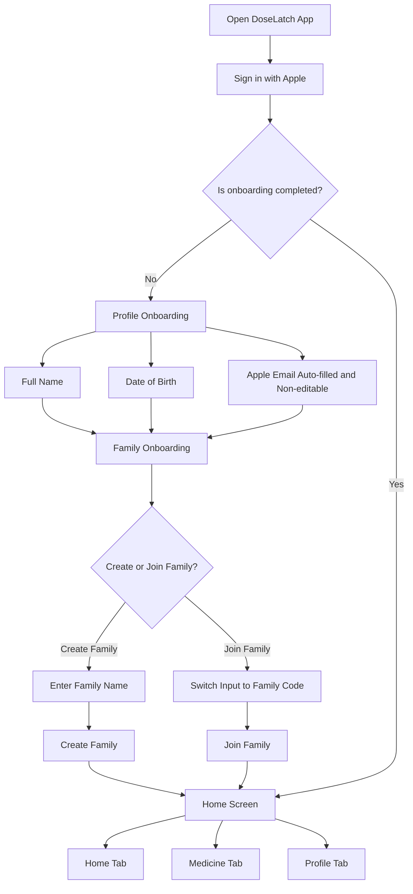
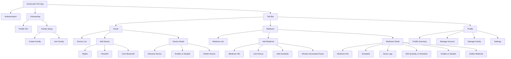
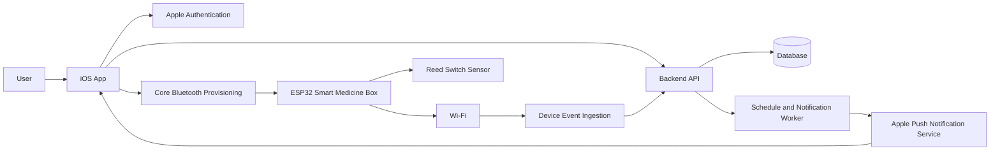
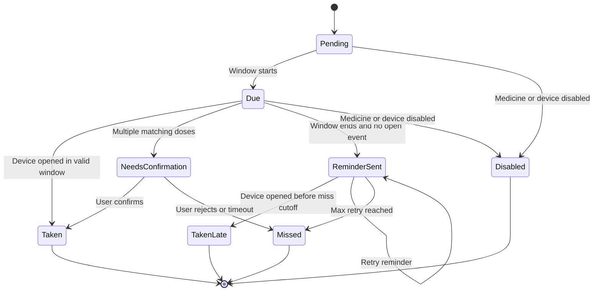
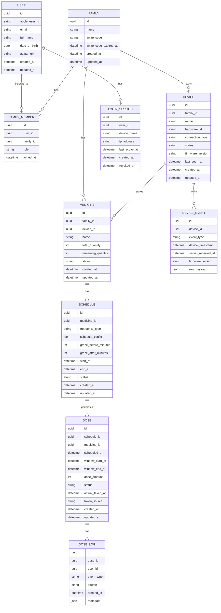

# Product Requirements Document: DoseLatch

**Product name recommendation:** DoseLatch  
**Category:** IoT with integrated iOS app  
**Document version:** v1.0  
**Prepared for:** Product discovery, design, engineering, and TestFlight planning  
**Primary platforms:** iOS app, ESP32-based smart pill box, backend service  
**Status:** Draft for review

---

## 1. Product Naming

### Recommended Name: DoseLatch

**Rationale**

- **Dose** clearly represents medication intake and scheduled dosage.
- **Latch** represents the physical open and close behavior of the medicine box.
- The name is short, easy to remember, and closely tied to the core product mechanism.
- It works well for both the app and the hardware device.

### Alternative Names

| Option | Rationale |
|---|---|
| DoseNest | Feels warm and family-oriented. Good for caregiver use cases. |
| CareLatch | Emphasizes family care and physical detection. |
| PillNest | Simple and easy to understand, but less unique. |
| MedLatch | Clear product fit, but more generic than DoseLatch. |
| DoseLoop | Good for schedule and adherence loops, but less tied to hardware. |

**Final recommendation:** Use **DoseLatch** for the MVP.

---

## 2. Executive Summary

DoseLatch is an IoT medication reminder product that combines an iOS app with an ESP32-based smart medicine box. The device uses a reed switch sensor to detect whether the medicine box is opened or closed. The iOS app allows users to create medication schedules, connect medicine boxes, track medicine intake, receive reminders, and manage family-based access.

The core product goal is to reduce missed medication by combining scheduled reminders with physical behavior tracking. Instead of relying only on user confirmation, DoseLatch uses box open and close events as adherence signals.

---

## 3. Problem Statement

Many people forget to take medicine on time, especially when they manage multiple medications or care for family members. Standard reminder apps can notify users, but they cannot verify whether the medicine box was opened.

DoseLatch solves this by linking medication schedules with smart box events. When the scheduled dose window starts, the app reminds the user. If the medicine box is opened during the valid grace period, the system records the dose as taken. If the box is not opened, the system sends follow-up reminders and marks the dose as missed when the reminder window expires.

---

## 4. Product Goals

### Business Goals

| Goal | Description |
|---|---|
| Improve medication adherence | Help users take medicine within the scheduled time window. |
| Support family care | Allow family members to monitor medication routines together. |
| Validate IoT tracking behavior | Prove that reed switch detection can create useful intake logs. |
| Prepare for scalable smart device management | Build a foundation for multi-device and multi-family support. |

### User Goals

| User Goal | Expected Outcome |
|---|---|
| Schedule medication reminders | User receives reminders based on daily, weekly, or hourly schedules. |
| Track whether medicine was taken | User can see dose logs generated from smart box activity. |
| Manage medicine boxes | User can add, rename, enable, disable, and delete devices. |
| Manage family members | User can create or join a family and share device visibility. |
| Review medication history | User can see taken, missed, skipped, and pending doses. |

---

## 5. Target Audience

### Primary Users

| Segment | Description | Key Need |
|---|---|---|
| Individual medication users | People who take medicine regularly. | Reliable reminders and simple intake tracking. |
| Family caregivers | Users who help family members remember medication. | Shared visibility across family members and devices. |
| Elderly users with support | Older adults whose family members help manage schedules. | Simple app flow, clear notifications, and low-friction tracking. |

### Secondary Users

| Segment | Description | Key Need |
|---|---|---|
| Health-focused households | Families managing supplements or recurring medicine. | Centralized medicine and device management. |
| Prototype testers | Early TestFlight users validating the IoT workflow. | Stable pairing, clear logs, and understandable device states. |

---

## 6. Key Assumptions

1. The first version targets iOS only.
2. Users authenticate using Sign in with Apple only.
3. Email from Apple ID is non-editable after onboarding.
4. Each device belongs to one family.
5. One family can have many users and many devices.
6. One device can be linked to multiple medicines, but overlapping schedules require special handling.
7. One dose equals one medicine unit by default, unless dosage amount is added later.
8. Reed switch open and close events indicate box interaction, not guaranteed pill ingestion.
9. The backend generates scheduled doses after medicine and schedule confirmation.
10. The MVP uses Core Bluetooth for device onboarding and provisioning. Matter and HomeKit are treated as optional integration paths because they add certification and ecosystem complexity.

---

## 7. Out of Scope

| Item | Reason |
|---|---|
| Medical advice or diagnosis | Product is a reminder and tracking tool, not a clinical decision system. |
| Automatic pill recognition | Reed switch detects box opening only, not which pill was removed. |
| Pharmacy integration | Not required for MVP. |
| Doctor dashboard | Family use case is prioritized first. |
| Insurance or hospital integration | Too broad for initial version. |
| Android app | iOS app is the first platform. |
| Apple Watch app | Useful later, but not required for MVP. |
| Refill ordering | Can be added after inventory tracking is validated. |
| Multi-compartment sensor detection | MVP only detects box-level open and close events. |

---

## 8. Product Scope

### MVP Scope

- Sign in with Apple.
- User onboarding with profile and family setup.
- Create family or join family using family code.
- Home tab with device list and add device flow.
- Device provisioning using Core Bluetooth as the MVP path.
- Device management: rename, enable, disable, delete.
- Medicine tab with add medicine flow.
- Schedule creation for daily, weekly, and hourly schedules.
- Grace period configuration.
- Backend-generated dose list.
- Medicine detail with dose logs and schedule management.
- Reminder notifications.
- Reed switch open and close event tracking.
- Profile tab with profile, family, device counts, and settings.
- Account, family, notification, appearance, security, language, and region settings.

### Phase 2 Scope

- Matter integration.
- HomeKit integration if commercial certification path is required.
- Apple Watch companion reminders.
- Caregiver escalation alerts.
- Multiple dose units per schedule.
- Manual correction flow with audit log.
- Medication refill prediction.
- Device battery tracking.
- Firmware over-the-air update.
- Multi-box household analytics.

---

## 9. User Personas

### Persona 1: Regular Medication User

**Name:** Rina  
**Age:** 32  
**Context:** Takes supplements and prescribed medicine daily.  
**Pain points:** Forgets afternoon medicine during work.  
**Goal:** Receive reminders and see whether she already opened the medicine box.

### Persona 2: Family Caregiver

**Name:** Adi  
**Age:** 40  
**Context:** Helps his parent manage medication.  
**Pain points:** Does not know whether his parent took medicine on time.  
**Goal:** Share device access through family and monitor missed doses.

### Persona 3: Elderly User

**Name:** Sari  
**Age:** 67  
**Context:** Takes medicine several times per day.  
**Pain points:** Finds complex apps difficult.  
**Goal:** Use a simple app and rely on family help for setup.

---

## 10. Core User Flow



---

## 11. Information Architecture



---

## 12. System Context



---

## 13. Technical Recommendation

### Connectivity Recommendation

| Option | Recommendation | Reason |
|---|---|---|
| Core Bluetooth | Use for MVP | Best fit for direct app-to-device setup and nearby provisioning. |
| Matter | Phase 2 | Good for smart home interoperability, but adds development complexity. |
| HomeKit | Phase 2 or commercial track | Useful for Apple Home integration, but commercial accessories may require MFi enrollment and certification. |

### Suggested MVP Device Flow

1. ESP32 advertises as an unpaired DoseLatch device over BLE.
2. iOS app scans for nearby DoseLatch devices.
3. User selects a device.
4. App sends Wi-Fi credentials and pairing token to ESP32 over BLE.
5. ESP32 connects to Wi-Fi.
6. ESP32 registers itself with the backend using the pairing token.
7. Backend links the device to the user's family.
8. App asks user to name the device.
9. Device appears in the Home tab device list.

---

## 14. Functional Requirements

### 14.1 Authentication

| ID | Requirement | Priority |
|---|---|---|
| AUTH-001 | User must be able to sign in using Sign in with Apple. | Must Have |
| AUTH-002 | App must request user name and email from Apple where available. | Must Have |
| AUTH-003 | Email from Apple must be stored as a non-editable account field. | Must Have |
| AUTH-004 | Backend must verify Apple identity token before creating or updating a session. | Must Have |
| AUTH-005 | User must stay logged in across app restarts unless session expires or user logs out. | Must Have |
| AUTH-006 | User must be able to view active login sessions in Manage Account. | Should Have |
| AUTH-007 | User must be able to revoke active sessions. | Should Have |

### 14.2 Onboarding

| ID | Requirement | Priority |
|---|---|---|
| ONB-001 | App must show onboarding after first successful login if profile is incomplete. | Must Have |
| ONB-002 | User must enter full name. | Must Have |
| ONB-003 | User must enter date of birth. | Must Have |
| ONB-004 | User email must be auto-filled from Apple account and non-editable. | Must Have |
| ONB-005 | User must create or join a family before entering the main app. | Must Have |
| ONB-006 | Create family flow must ask for family name. | Must Have |
| ONB-007 | Join family flow must replace family name input with family code input. | Must Have |
| ONB-008 | App must validate family code before joining. | Must Have |
| ONB-009 | After onboarding completion, app must navigate to Home screen. | Must Have |

### 14.3 Family Management

| ID | Requirement | Priority |
|---|---|---|
| FAM-001 | User must be able to create a family. | Must Have |
| FAM-002 | User must be able to join a family using a family code. | Must Have |
| FAM-003 | Family owner must be able to rename the family. | Must Have |
| FAM-004 | Family owner or admin must be able to invite new members. | Must Have |
| FAM-005 | Family owner or admin must be able to remove members. | Must Have |
| FAM-006 | User must be able to view family members. | Must Have |
| FAM-007 | User must be able to view devices in the family. | Must Have |
| FAM-008 | System must prevent removing the last family owner. | Must Have |
| FAM-009 | Family code should expire after a configurable duration. | Should Have |

### 14.4 Home Tab: Device List

| ID | Requirement | Priority |
|---|---|---|
| DEV-001 | Home tab must show all devices linked to the user's active family. | Must Have |
| DEV-002 | Device card must show device name, status, last seen time, and connection state. | Must Have |
| DEV-003 | User must be able to add a new device. | Must Have |
| DEV-004 | Device list must support empty state when no device exists. | Must Have |
| DEV-005 | Device list must show disabled devices with clear visual state. | Should Have |

### 14.5 Home Tab: Add Device

| ID | Requirement | Priority |
|---|---|---|
| DEV-ADD-001 | User must be able to choose a device connection method. | Must Have |
| DEV-ADD-002 | MVP must support Core Bluetooth provisioning. | Must Have |
| DEV-ADD-003 | App should display Matter and HomeKit as future or experimental options if not implemented. | Could Have |
| DEV-ADD-004 | App must scan for nearby unpaired ESP32 devices. | Must Have |
| DEV-ADD-005 | User must be able to select a detected device. | Must Have |
| DEV-ADD-006 | App must pair the selected device with the user's family. | Must Have |
| DEV-ADD-007 | User must enter a device name after successful pairing. | Must Have |
| DEV-ADD-008 | Device name must be unique within the family. | Should Have |
| DEV-ADD-009 | App must show clear error state if pairing fails. | Must Have |

### 14.6 Home Tab: Device Detail

| ID | Requirement | Priority |
|---|---|---|
| DEV-DET-001 | User must be able to open device detail from the device list. | Must Have |
| DEV-DET-002 | User must be able to rename a device. | Must Have |
| DEV-DET-003 | User must be able to enable or disable a device. | Must Have |
| DEV-DET-004 | User must be able to delete a device. | Must Have |
| DEV-DET-005 | Deleting a device must require confirmation. | Must Have |
| DEV-DET-006 | Disabled device must not trigger medicine intake tracking. | Must Have |
| DEV-DET-007 | Deleted device must be unlinked from active medicines. | Must Have |
| DEV-DET-008 | App must warn user if deleting a device affects active medicines. | Must Have |

### 14.7 Medicine Tab: Add Medicine

| ID | Requirement | Priority |
|---|---|---|
| MED-ADD-001 | User must be able to add a new medicine. | Must Have |
| MED-ADD-002 | User must enter medicine name. | Must Have |
| MED-ADD-003 | User must link medicine to one device. | Must Have |
| MED-ADD-004 | User must enter medicine quantity. | Must Have |
| MED-ADD-005 | Quantity must be a positive integer. | Must Have |
| MED-ADD-006 | User must create at least one schedule before saving medicine. | Must Have |
| MED-ADD-007 | User must review generated dose list before saving medicine. | Must Have |
| MED-ADD-008 | User must be able to go back and edit schedule before confirming. | Must Have |
| MED-ADD-009 | User must be able to save medicine after confirming generated doses. | Must Have |

### 14.8 Medicine Schedule

| ID | Requirement | Priority |
|---|---|---|
| SCH-001 | User must select schedule frequency: daily, weekly, or hourly. | Must Have |
| SCH-002 | Daily schedule must require one or more times of day. | Must Have |
| SCH-003 | Weekly schedule must require one or more weekdays. | Must Have |
| SCH-004 | Weekly schedule should require one or more times of day for each selected weekday. | Must Have |
| SCH-005 | Hourly schedule must require interval in hours. | Must Have |
| SCH-006 | Hourly schedule must use start date and start time as the anchor. | Must Have |
| SCH-007 | User must set grace period before scheduled dose time. | Must Have |
| SCH-008 | User must set grace period after scheduled dose time. | Must Have |
| SCH-009 | User must set schedule start date. | Must Have |
| SCH-010 | User may set schedule end date. | Must Have |
| SCH-011 | End date must be later than start date. | Must Have |
| SCH-012 | System must regenerate future doses when quantity or schedule changes. | Must Have |
| SCH-013 | System must preserve historical doses and logs when schedule changes. | Must Have |

### 14.9 Dose Generation

| ID | Requirement | Priority |
|---|---|---|
| DOSE-001 | Backend must generate doses after user confirms medicine schedule. | Must Have |
| DOSE-002 | Dose generation must start from schedule start date. | Must Have |
| DOSE-003 | Dose generation must stop when medicine quantity is exhausted if no end date is set. | Must Have |
| DOSE-004 | Dose generation must stop at end date if end date exists. | Must Have |
| DOSE-005 | Dose generation must not exceed available quantity. | Must Have |
| DOSE-006 | Each generated dose must include scheduled time, grace window, status, and linked medicine. | Must Have |
| DOSE-007 | Default dose amount is one unit per scheduled dose. | Must Have |
| DOSE-008 | Generated dose list must be shown to user before saving. | Must Have |
| DOSE-009 | Historical doses must not be deleted when schedule changes. | Must Have |
| DOSE-010 | Future pending doses must be replaced when schedule or quantity changes. | Must Have |

### 14.10 Dose Status

| Status | Meaning |
|---|---|
| Pending | Dose is generated but not yet due. |
| Due | Dose is inside the active grace window. |
| Taken | Device was opened during the valid dose window or user manually confirmed. |
| Missed | Dose was not taken within allowed reminder window. |
| Skipped | User intentionally skipped the dose. |
| Needs Confirmation | Device was opened, but system found multiple candidate doses. |
| Disabled | Medicine or device was disabled before dose execution. |

### 14.11 Reminder Logic

| ID | Requirement | Priority |
|---|---|---|
| REM-001 | System must send reminder at the start of the dose window. | Must Have |
| REM-002 | Dose window starts at scheduled time minus grace-before minutes. | Must Have |
| REM-003 | Dose window ends at scheduled time plus grace-after minutes. | Must Have |
| REM-004 | If no matching open event occurs by the end of the window, system must send follow-up reminder. | Must Have |
| REM-005 | Follow-up reminder interval should use grace-after duration by default. | Should Have |
| REM-006 | System should support configurable maximum reminder retries. | Should Have |
| REM-007 | If user takes medicine after follow-up reminder but before miss cutoff, dose must be marked taken late. | Should Have |
| REM-008 | If dose remains untaken after the final retry, system must mark it as missed. | Must Have |
| REM-009 | Notifications must respect user notification preferences. | Must Have |
| REM-010 | Notifications must support local and remote notification strategy depending on app state and backend availability. | Must Have |

### 14.12 Device Event Tracking

| ID | Requirement | Priority |
|---|---|---|
| EVT-001 | ESP32 must detect reed switch state changes. | Must Have |
| EVT-002 | ESP32 must send open and close events to the backend. | Must Have |
| EVT-003 | Device event must include device ID, event type, timestamp, and firmware version. | Must Have |
| EVT-004 | Backend must match open events to active dose windows. | Must Have |
| EVT-005 | If exactly one due dose matches the event, system must mark that dose as taken. | Must Have |
| EVT-006 | If multiple due doses match the event, system must mark candidates as Needs Confirmation. | Must Have |
| EVT-007 | If no due dose matches the event, system must store event as unmatched activity log. | Must Have |
| EVT-008 | System must debounce reed switch events to avoid duplicate logs. | Must Have |
| EVT-009 | Device must retry event delivery when offline. | Should Have |
| EVT-010 | Backend must ignore events from disabled or deleted devices. | Must Have |

### 14.13 Medicine List

| ID | Requirement | Priority |
|---|---|---|
| MED-LIST-001 | Medicine tab must show list of added medicines. | Must Have |
| MED-LIST-002 | Each medicine card must show medicine name, linked device, remaining quantity, next dose time, and status. | Must Have |
| MED-LIST-003 | Empty state must guide user to add medicine. | Must Have |
| MED-LIST-004 | User must be able to open medicine detail from list. | Must Have |
| MED-LIST-005 | Disabled medicine must be visually distinct. | Should Have |

### 14.14 Medicine Detail

| ID | Requirement | Priority |
|---|---|---|
| MED-DET-001 | Medicine detail must show medicine name. | Must Have |
| MED-DET-002 | Medicine detail must show total quantity and remaining quantity. | Must Have |
| MED-DET-003 | Medicine detail must show linked device. | Must Have |
| MED-DET-004 | Medicine detail must show active schedule. | Must Have |
| MED-DET-005 | Medicine detail must show generated dose list. | Must Have |
| MED-DET-006 | Dose list must show scheduled time, actual taken time, status, and source. | Must Have |
| MED-DET-007 | User must be able to edit schedule. | Must Have |
| MED-DET-008 | User must be able to update medicine quantity. | Must Have |
| MED-DET-009 | Schedule or quantity updates must preserve past dose history. | Must Have |
| MED-DET-010 | Schedule or quantity updates must regenerate future doses. | Must Have |
| MED-DET-011 | User must be able to enable or disable medicine. | Must Have |
| MED-DET-012 | User must be able to delete medicine. | Must Have |
| MED-DET-013 | Deleting medicine must require confirmation. | Must Have |

### 14.15 Profile Tab

| ID | Requirement | Priority |
|---|---|---|
| PRO-001 | Profile tab must show full name and avatar. | Must Have |
| PRO-002 | Profile tab must show family count. | Must Have |
| PRO-003 | Profile tab must show device count. | Must Have |
| PRO-004 | Profile tab must show family name and member count. | Must Have |
| PRO-005 | Profile tab must provide entry points to Manage Account, Manage Family, and Settings. | Must Have |

### 14.16 Manage Account

| ID | Requirement | Priority |
|---|---|---|
| ACC-001 | User must be able to edit full name. | Must Have |
| ACC-002 | User must be able to edit date of birth. | Must Have |
| ACC-003 | User must be able to upload or change avatar. | Should Have |
| ACC-004 | User must be able to view login history. | Should Have |
| ACC-005 | User must be able to view active login sessions. | Should Have |
| ACC-006 | User must be able to delete account. | Must Have |
| ACC-007 | Delete account must require confirmation and explain data impact. | Must Have |

### 14.17 Settings

| ID | Requirement | Priority |
|---|---|---|
| SET-001 | User must be able to change appearance: light, dark, or system. | Must Have |
| SET-002 | User must be able to manage notification preferences. | Must Have |
| SET-003 | User must be able to enable Face ID lock. | Should Have |
| SET-004 | User must be able to enable passcode lock. | Should Have |
| SET-005 | User must be able to change language. | Should Have |
| SET-006 | App must support English and Indonesian as initial languages. | Should Have |
| SET-007 | User must be able to change region. | Should Have |
| SET-008 | Region must affect date, time, and week start formatting. | Should Have |

---

## 15. Dose Generation Rules

### 15.1 Inputs

| Field | Required | Description |
|---|---:|---|
| Medicine name | Yes | Human-readable medicine name. |
| Linked device | Yes | Device where medicine is stored. |
| Quantity | Yes | Total available units. |
| Dose amount | No for MVP | Default is 1 unit per dose. |
| Frequency type | Yes | Daily, weekly, or hourly. |
| Times of day | Required for daily and weekly | One or more times. |
| Weekdays | Required for weekly | Selected days. |
| Hourly interval | Required for hourly | Interval in hours. |
| Start date and time | Yes | Schedule anchor. |
| End date | Optional | Schedule cutoff. |
| Grace before | Yes | Minutes before scheduled time. |
| Grace after | Yes | Minutes after scheduled time. |

### 15.2 Daily Schedule Example

**Input**

- Quantity: 10
- Frequency: Daily
- Times: 08:00, 13:00, 18:00
- Start date: 2026-07-01
- End date: None
- Dose amount: 1

**Output**

- Backend generates 10 doses.
- Doses start from 2026-07-01 08:00.
- Doses continue by daily time order until 10 units are scheduled.

### 15.3 Weekly Schedule Example

**Input**

- Quantity: 8
- Frequency: Weekly
- Days: Monday, Wednesday, Friday
- Time: 09:00
- Start date: 2026-07-01
- End date: None

**Output**

- Backend generates doses only on selected weekdays.
- Generation stops when 8 doses are created.

### 15.4 Hourly Schedule Example

**Input**

- Quantity: 10
- Frequency: Hourly
- Interval: Every 8 hours
- Start date and time: 2026-07-01 08:00
- End date: None

**Output**

- Backend generates 10 doses:
  - 2026-07-01 08:00
  - 2026-07-01 16:00
  - 2026-07-02 00:00
  - Continue every 8 hours until 10 doses exist.

### 15.5 End Date Rule

If end date exists, backend must stop dose generation at the earlier condition:

1. Quantity is exhausted.
2. End date is reached.

### 15.6 Update Rule

When user updates quantity or schedule:

1. Past doses remain unchanged.
2. Taken and missed logs remain unchanged.
3. Future pending doses are deleted or archived as superseded.
4. New future doses are generated from the update effective date.
5. App shows a confirmation screen before applying update.

---

## 16. Reminder and Tracking State Machine



---

## 17. Data Model



---

## 18. API Requirements

### Authentication

| Method | Endpoint | Description |
|---|---|---|
| POST | `/auth/apple` | Verify Apple identity token and create session. |
| POST | `/auth/logout` | Revoke current session. |
| GET | `/auth/sessions` | List active sessions. |
| DELETE | `/auth/sessions/{id}` | Revoke selected session. |

### User and Onboarding

| Method | Endpoint | Description |
|---|---|---|
| GET | `/me` | Get current user profile. |
| PATCH | `/me` | Update full name, date of birth, or avatar. |
| DELETE | `/me` | Delete account. |
| POST | `/onboarding/complete` | Mark onboarding as completed. |

### Family

| Method | Endpoint | Description |
|---|---|---|
| POST | `/families` | Create family. |
| POST | `/families/join` | Join family by code. |
| GET | `/families/current` | Get active family. |
| PATCH | `/families/{id}` | Rename family. |
| POST | `/families/{id}/invite-code` | Generate or refresh family code. |
| GET | `/families/{id}/members` | List members. |
| DELETE | `/families/{id}/members/{memberId}` | Remove member. |

### Device

| Method | Endpoint | Description |
|---|---|---|
| GET | `/devices` | List family devices. |
| POST | `/devices/pairing-token` | Create pairing token for device onboarding. |
| POST | `/devices/register` | Register ESP32 device after provisioning. |
| PATCH | `/devices/{id}` | Rename, enable, or disable device. |
| DELETE | `/devices/{id}` | Delete device. |
| POST | `/devices/{id}/events` | Ingest open and close events. |

### Medicine and Schedule

| Method | Endpoint | Description |
|---|---|---|
| GET | `/medicines` | List medicines. |
| POST | `/medicines/preview-doses` | Preview generated doses before save. |
| POST | `/medicines` | Create medicine, schedule, and doses. |
| GET | `/medicines/{id}` | Get medicine detail. |
| PATCH | `/medicines/{id}` | Update medicine info, quantity, status, or linked device. |
| POST | `/medicines/{id}/reschedule-preview` | Preview regenerated future doses. |
| POST | `/medicines/{id}/reschedule` | Apply schedule update and regenerate future doses. |
| DELETE | `/medicines/{id}` | Delete medicine. |

### Dose

| Method | Endpoint | Description |
|---|---|---|
| GET | `/medicines/{id}/doses` | List medicine doses. |
| POST | `/doses/{id}/mark-taken` | Manually mark dose as taken. |
| POST | `/doses/{id}/mark-skipped` | Mark dose as skipped. |
| POST | `/doses/{id}/confirm` | Confirm dose after ambiguous device event. |

---

## 19. Device Firmware Requirements

| ID | Requirement | Priority |
|---|---|---|
| FW-001 | Device must detect reed switch open and close state. | Must Have |
| FW-002 | Device must debounce reed switch changes. | Must Have |
| FW-003 | Device must expose BLE provisioning service. | Must Have |
| FW-004 | Device must receive Wi-Fi credentials securely during provisioning. | Must Have |
| FW-005 | Device must persist device ID and pairing credentials. | Must Have |
| FW-006 | Device must send open and close events to backend. | Must Have |
| FW-007 | Device must queue events when offline. | Should Have |
| FW-008 | Device must sync time from backend or NTP. | Should Have |
| FW-009 | Device must expose firmware version. | Must Have |
| FW-010 | Device should support factory reset. | Must Have |
| FW-011 | Device should support battery or power status if hardware allows. | Could Have |
| FW-012 | Device should support OTA firmware update. | Could Have |

---

## 20. UX/UI Notes

### Design Principles

- Use simple navigation with three main tabs: Home, Medicine, Profile.
- Keep onboarding short and linear.
- Make reminder windows easy to understand.
- Use clear dose status labels: Pending, Due, Taken, Missed, Skipped.
- Avoid technical terms like reed switch in consumer-facing screens.
- Use plain device states: Connected, Last seen, Disabled, Setup failed.

### Onboarding Screens

1. **Welcome screen**
   - Primary CTA: Sign in with Apple.

2. **Profile setup**
   - Full name input.
   - Date of birth picker.
   - Email field auto-filled and disabled.

3. **Family setup**
   - Toggle: Create Family or Join Family.
   - Create mode: Family name input.
   - Join mode: Family code input.

4. **Completion screen**
   - Message: “Your family is ready.”
   - CTA: Continue to Home.

### Home Tab

- Empty state: “No medicine box connected yet.”
- CTA: Add Device.
- Device card:
  - Device name.
  - Status.
  - Last seen.
  - Number of linked medicines.

### Add Device Flow

1. Choose setup method.
2. Scan nearby devices.
3. Select device.
4. Connect and provision.
5. Name device.
6. Save to family.

### Medicine Tab

- Empty state: “No medicine added yet.”
- CTA: Add Medicine.
- Medicine card:
  - Medicine name.
  - Linked device.
  - Remaining quantity.
  - Next dose time.
  - Current status.

### Add Medicine Flow

1. Enter medicine name.
2. Select device.
3. Enter quantity.
4. Select schedule type.
5. Configure schedule.
6. Set grace period.
7. Set start date and optional end date.
8. Review generated doses.
9. Confirm and save.

### Medicine Detail

- Header: medicine name and status.
- Summary: total quantity, remaining quantity, linked device.
- Schedule card.
- Dose list with filters:
  - Upcoming.
  - Taken.
  - Missed.
  - Needs confirmation.
- Actions:
  - Edit schedule.
  - Update quantity.
  - Disable medicine.
  - Delete medicine.

### Profile Tab

- Profile summary.
- Family summary.
- Device count.
- Menu:
  - Manage Account.
  - Manage Family.
  - Settings.

---

## 21. User Stories

### Authentication and Onboarding

| ID | User Story |
|---|---|
| US-001 | As a user, I want to sign in using my Apple account so that I can access the app securely. |
| US-002 | As a user, I want my Apple email to be filled automatically so that I do not need to type it manually. |
| US-003 | As a user, I want to create a family so that my devices and medicines can be grouped properly. |
| US-004 | As a user, I want to join an existing family using a code so that I can share access with my family members. |

### Device Management

| ID | User Story |
|---|---|
| US-005 | As a user, I want to add a smart medicine box so that the app can track box opening events. |
| US-006 | As a user, I want to name my device so that I can recognize it easily. |
| US-007 | As a user, I want to disable a device so that it stops tracking temporarily. |
| US-008 | As a user, I want to delete a device so that unused devices are removed from my family. |

### Medicine and Schedule

| ID | User Story |
|---|---|
| US-009 | As a user, I want to add medicine so that I can track it in the app. |
| US-010 | As a user, I want to link medicine to a device so that box events can be matched to dose schedules. |
| US-011 | As a user, I want to create a daily schedule so that I can take medicine at fixed times each day. |
| US-012 | As a user, I want to create a weekly schedule so that I can take medicine only on selected days. |
| US-013 | As a user, I want to create an hourly schedule so that I can take medicine at fixed intervals. |
| US-014 | As a user, I want to set grace periods so that the app knows the valid time window for taking medicine. |
| US-015 | As a user, I want to review generated doses before saving so that I can confirm the schedule is correct. |
| US-016 | As a user, I want to edit schedule and quantity so that my medication plan stays accurate. |

### Tracking and Reminder

| ID | User Story |
|---|---|
| US-017 | As a user, I want the app to remind me before or during my dose window so that I take medicine on time. |
| US-018 | As a user, I want the app to mark my medicine as taken when I open the box during the valid window. |
| US-019 | As a user, I want missed doses to be logged so that I can review adherence history. |
| US-020 | As a caregiver, I want to see dose logs so that I know whether my family member took medicine. |

---

## 22. Acceptance Criteria

### AC-001: Sign in with Apple

```gherkin
Given the user opens the app for the first time
When the user taps "Sign in with Apple"
And Apple authentication succeeds
Then the system creates or resumes the user session
And the user is redirected to onboarding if their profile is incomplete
```

### AC-002: Email Non-editable in Onboarding

```gherkin
Given the user has signed in with Apple
When the user reaches the profile onboarding screen
Then the email field is pre-filled from Apple account data
And the email field cannot be edited
```

### AC-003: Create Family

```gherkin
Given the user is on the family onboarding screen
When the user selects "Create Family"
And enters a valid family name
And taps "Continue"
Then the system creates a family
And assigns the user as family owner
And redirects the user to the Home screen
```

### AC-004: Join Family

```gherkin
Given the user is on the family onboarding screen
When the user selects "Join Family"
Then the family name input changes to family code input
When the user enters a valid family code
And taps "Join"
Then the system adds the user to the family
And redirects the user to the Home screen
```

### AC-005: Add Device via Core Bluetooth

```gherkin
Given the user is on the Home tab
When the user taps "Add Device"
And selects Core Bluetooth setup
Then the app scans for nearby unpaired DoseLatch devices
When the user selects a device
And provisioning succeeds
Then the app asks the user to enter a device name
When the user saves the name
Then the device appears in the Home tab device list
```

### AC-006: Add Daily Medicine Schedule

```gherkin
Given the user is adding medicine
When the user enters medicine name, linked device, and quantity
And selects daily frequency
And enters one or more times of day
And sets grace period and start date
Then the system can generate a valid dose preview
```

### AC-007: Add Hourly Medicine Schedule

```gherkin
Given the user is adding medicine
When the user selects hourly frequency
And enters an interval of 8 hours
And sets start date to tomorrow at 08:00
And quantity is 10
Then the backend generates 10 doses every 8 hours starting from the start date and time
```

### AC-008: Review Generated Doses

```gherkin
Given the system has generated dose preview
When the user views the review screen
Then the user sees each scheduled dose time
And the user can go back to edit the schedule
And the user can confirm and save the medicine
```

### AC-009: Device Open Marks Dose as Taken

```gherkin
Given a dose is inside its valid grace window
And the linked device is enabled
When the backend receives a box open event from the device
Then the system marks the matching dose as taken
And records the actual taken time
And decreases remaining medicine quantity by the dose amount
```

### AC-010: Missed Dose

```gherkin
Given a dose is inside its valid grace window
When the user does not open the linked device before the reminder cutoff
Then the system marks the dose as missed
And stores a missed dose log
```

### AC-011: Multiple Candidate Doses

```gherkin
Given multiple medicines linked to the same device have overlapping dose windows
When the device sends an open event
Then the system does not automatically mark all doses as taken
And marks matching doses as needs confirmation
And asks the user to confirm which medicine was taken
```

### AC-012: Edit Schedule Preserves Past Logs

```gherkin
Given a medicine has past taken and missed doses
When the user updates the medicine schedule
Then the system keeps historical dose logs unchanged
And regenerates only future pending doses
```

### AC-013: Disable Device

```gherkin
Given a device is enabled
When the user disables the device
Then the device remains visible in the device list
And new device events do not update medicine dose status
```

### AC-014: Delete Medicine

```gherkin
Given the user is on medicine detail
When the user taps delete medicine
Then the app shows a confirmation dialog
When the user confirms deletion
Then the medicine is removed from active list
And historical logs are retained according to retention policy
```

---

## 23. Edge Cases

| Case | Expected Behavior |
|---|---|
| Apple does not return full name after first login | Ask user to enter full name manually. |
| Apple returns private relay email | Store it as the account email and keep it non-editable. |
| User tries to join invalid family code | Show validation error. |
| User has no family after account recovery | Prompt user to create or join family. |
| Device pairing fails | Show retry and troubleshooting instructions. |
| Device offline during dose window | Continue reminders and mark dose based on available events. |
| Device sends delayed open event | Match based on event timestamp if trusted, otherwise server received time. |
| Reed switch sends duplicate events | Debounce and ignore duplicate events within configured threshold. |
| Multiple medicines have same dose window on same device | Mark as needs confirmation. |
| User disables medicine before future dose | Future doses should be disabled or paused. |
| User deletes linked device | Warn that active medicine tracking will be affected. |
| Quantity is lower than generated schedule count | Generate only up to available quantity. |
| End date comes before quantity is exhausted | Stop generation at end date. |
| User changes timezone or region | Future schedules should respect selected region and timezone rules. |
| Notification permission denied | Show in-app banner and guide user to enable notifications. |

---

## 24. Non-Functional Requirements

### Performance

| ID | Requirement | Target |
|---|---|---|
| NFR-PERF-001 | App cold start time | Under 3 seconds on supported devices. |
| NFR-PERF-002 | Home device list load time | Under 1 second after cached data is available. |
| NFR-PERF-003 | Dose preview generation | Under 2 seconds for up to 365 generated doses. |
| NFR-PERF-004 | Device event processing latency | Under 5 seconds from backend receipt to dose status update. |

### Reliability

| ID | Requirement | Target |
|---|---|---|
| NFR-REL-001 | Device event ingestion uptime | 99.5 percent for MVP backend. |
| NFR-REL-002 | Notification job success rate | 99 percent for scheduled reminders. |
| NFR-REL-003 | Duplicate event handling | Duplicate open events must not create duplicate dose logs. |
| NFR-REL-004 | Offline handling | Device should queue events while offline if storage allows. |

### Security and Privacy

| ID | Requirement | Target |
|---|---|---|
| NFR-SEC-001 | Authentication | Apple identity token must be verified server-side. |
| NFR-SEC-002 | Data access | Users can access only data from their family. |
| NFR-SEC-003 | Device pairing | Pairing token must expire after a short duration. |
| NFR-SEC-004 | Transport security | App and device communication with backend must use TLS where supported. |
| NFR-SEC-005 | Sensitive data | Store only required profile and medication data. |
| NFR-SEC-006 | Local lock | Face ID or passcode lock should protect app access. |

### Accessibility

| ID | Requirement | Target |
|---|---|---|
| NFR-A11Y-001 | Dynamic Type | App should support iOS Dynamic Type. |
| NFR-A11Y-002 | VoiceOver | Core navigation and forms should work with VoiceOver. |
| NFR-A11Y-003 | Contrast | App should meet readable contrast for light and dark mode. |
| NFR-A11Y-004 | Touch targets | Main buttons should follow iOS touch target guidelines. |

### Localization

| ID | Requirement | Target |
|---|---|---|
| NFR-LOC-001 | Initial languages | English and Indonesian. |
| NFR-LOC-002 | Date and time formatting | Based on selected region. |
| NFR-LOC-003 | Weekday names | Localized based on app language. |

### Observability

| ID | Requirement | Target |
|---|---|---|
| NFR-OBS-001 | Track onboarding completion rate. | Required. |
| NFR-OBS-002 | Track pairing success and failure. | Required. |
| NFR-OBS-003 | Track reminder delivery and interaction. | Required. |
| NFR-OBS-004 | Track dose status transitions. | Required. |
| NFR-OBS-005 | Track device event ingestion errors. | Required. |

---

## 25. Analytics Events

| Event Name | Trigger | Key Properties |
|---|---|---|
| `auth_apple_started` | User taps Sign in with Apple | app_version |
| `auth_apple_succeeded` | Apple auth succeeds | user_id |
| `onboarding_profile_completed` | Profile step completed | user_id |
| `family_created` | User creates family | family_id |
| `family_joined` | User joins family | family_id |
| `device_pairing_started` | Add device starts | method |
| `device_pairing_succeeded` | Device paired | device_id, method |
| `device_pairing_failed` | Pairing fails | method, error_code |
| `medicine_created` | Medicine saved | medicine_id, schedule_type |
| `dose_preview_generated` | Dose preview shown | dose_count, schedule_type |
| `dose_reminder_sent` | Reminder sent | dose_id, reminder_type |
| `device_open_event_received` | Backend receives open event | device_id |
| `dose_marked_taken` | Dose status becomes taken | source |
| `dose_marked_missed` | Dose status becomes missed | reason |
| `medicine_rescheduled` | User edits schedule | medicine_id |
| `account_deleted` | User deletes account | user_id |

---

## 26. Success Metrics and KPIs

### Activation KPIs

| KPI | Definition | Target for MVP |
|---|---|---:|
| Sign-in completion rate | Users who complete Apple sign-in divided by users who start sign-in. | 80 percent or higher |
| Onboarding completion rate | Users who complete onboarding divided by authenticated users. | 75 percent or higher |
| Device pairing success rate | Successful pairings divided by started pairings. | 70 percent or higher |
| First medicine creation rate | Users who create at least one medicine after onboarding. | 60 percent or higher |

### Engagement KPIs

| KPI | Definition | Target for MVP |
|---|---|---:|
| Weekly active users | Users who open the app at least once per week. | Track baseline |
| Medicine schedule creation rate | Medicines with valid schedules divided by created medicines. | 90 percent or higher |
| Notification interaction rate | Notifications opened or acted on divided by delivered notifications. | 30 percent or higher |

### Adherence KPIs

| KPI | Definition | Target for MVP |
|---|---|---:|
| On-time taken rate | Doses marked taken within grace window divided by due doses. | 70 percent or higher |
| Missed dose rate | Missed doses divided by due doses. | Track and reduce |
| Device-confirmed taken rate | Taken doses triggered by device event divided by all taken doses. | 60 percent or higher |
| Ambiguous event rate | Needs confirmation events divided by device open events. | Under 10 percent |

### Reliability KPIs

| KPI | Definition | Target for MVP |
|---|---|---:|
| Device event processing success | Successfully processed device events divided by received events. | 99 percent or higher |
| Reminder scheduling success | Successfully scheduled reminders divided by expected reminders. | 99 percent or higher |
| Pairing failure rate | Failed pairings divided by started pairings. | Under 30 percent |

---

## 27. Release Strategy

### Phase 0: Prototype Validation

**Goal:** Validate reed switch detection and basic schedule matching.

Scope:

- ESP32 reads reed switch state.
- Device sends open and close events.
- iOS app can add device manually or through simplified BLE flow.
- Backend can generate doses.
- System can mark a dose as taken from device event.

Exit criteria:

- Device can send stable open and close events.
- Backend can match event to dose window.
- App can show medicine detail and dose log.

### Phase 1: MVP TestFlight

**Goal:** Validate complete app flow with selected testers.

Scope:

- Sign in with Apple.
- Full onboarding.
- Family setup.
- Core Bluetooth device provisioning.
- Medicine and schedule management.
- Notifications.
- Dose tracking and logs.
- Profile and settings.

Exit criteria:

- At least 20 testers complete onboarding.
- At least 10 testers pair a device.
- At least 50 scheduled doses are generated.
- At least 30 device events are processed.

### Phase 2: Private Beta

**Goal:** Improve reliability, family monitoring, and device lifecycle.

Scope:

- Caregiver notifications.
- Better ambiguous dose confirmation.
- Device health and battery status.
- OTA firmware update if hardware allows.
- Matter exploration.

### Phase 3: Public Launch

**Goal:** Launch to broader users with stable hardware and app experience.

Scope:

- Production-grade device provisioning.
- Scalable notification infrastructure.
- Improved privacy controls.
- Support and troubleshooting flows.
- Hardware manufacturing readiness.

---

## 28. Go-To-Market Strategy

### Initial Positioning

**DoseLatch helps families track medication routines using smart box detection and iOS reminders.**

### Target Launch Audience

- People who take recurring medicine.
- Family caregivers.
- Households caring for elderly family members.
- Early adopters interested in health-related IoT products.

### Launch Channels

| Channel | Use |
|---|---|
| TestFlight | Validate MVP with controlled users. |
| Apple Developer Academy demo | Showcase product story and technical implementation. |
| Family caregiver communities | Recruit real-world testers. |
| Short product demo video | Explain app and device flow quickly. |
| Landing page | Capture interest and feedback. |

### Core Message

“Never guess whether medicine was taken. DoseLatch connects reminders with real smart box activity.”

---

## 29. Risks and Mitigations

| Risk | Impact | Mitigation |
|---|---|---|
| Reed switch only detects box opening, not actual pill intake. | Tracking may be inaccurate. | Clearly label logs as box-confirmed intake. Add manual confirmation and caregiver review. |
| Multiple medicines in one device create ambiguous tracking. | Incorrect dose status. | Detect overlapping windows and require confirmation. Consider one medicine per device rule for MVP. |
| BLE provisioning fails for some users. | Device activation drops. | Add retry flow, clear error messages, and manual troubleshooting. |
| Device offline during dose window. | Missed or delayed logs. | Queue events on device and show last seen state in app. |
| Notification permission denied. | User misses reminders. | Show permission education and in-app reminder center. |
| HomeKit commercial path requires certification. | Launch complexity increases. | Use Core Bluetooth for MVP and evaluate HomeKit later. |
| Matter implementation increases scope. | Timeline risk. | Keep Matter out of MVP unless smart home interoperability is required. |
| Timezone changes affect schedules. | Dose times may shift unexpectedly. | Store schedule timezone and show timezone change warning. |
| Account deletion affects family data. | Data ownership complexity. | Define retention and ownership rules before beta. |
| Medication data is sensitive. | Privacy and trust risk. | Minimize data, secure API access, and provide delete/export controls later. |

---

## 30. Open Questions for Product Confirmation

1. Should one device support multiple medicines in MVP, or should MVP enforce one medicine per device to avoid ambiguous tracking?
2. Should weekly schedules require times of day, or should selecting weekdays be enough with a default time?
3. Should dose amount be configurable, for example 2 pills per dose, or should MVP assume 1 unit per dose?
4. What should be the maximum reminder retry count after the grace period ends?
5. Should caregivers receive missed dose notifications, or only the user who owns the medicine schedule?
6. Should family members have roles such as Owner, Admin, and Member in MVP?
7. Should device pairing require Wi-Fi provisioning, or should the ESP32 communicate only through BLE for prototype scope?
8. Should users be able to manually mark a dose as taken without opening the device?
9. Should missed doses reduce remaining quantity, or only taken doses reduce inventory?
10. Should deleting a medicine permanently delete logs, or archive them for history?

---

## 31. Recommended Product Decisions

| Decision Area | Recommendation |
|---|---|
| Product name | DoseLatch |
| MVP connectivity | Core Bluetooth for setup, Wi-Fi for device event delivery |
| Schedule logic | Backend-generated doses with preview before save |
| Dose amount | Default 1 unit per dose for MVP |
| Multi-medicine device | Allow, but require confirmation if dose windows overlap |
| Reminder strategy | Reminder at window start, follow-up after grace window, then limited retries |
| Family model | Owner, Admin, Member |
| Tracking source | Device event as primary, manual confirmation as fallback |
| Language | English and Indonesian |
| Launch path | TestFlight first, then private beta |

---

## 32. References

These references informed the platform and technical assumptions in this PRD.

1. Apple Developer Documentation, AuthenticationServices and Sign in with Apple.
2. Apple Developer Documentation, Core Bluetooth.
3. Apple Developer, Developing apps and accessories for the home with HomeKit and Matter.
4. Apple MFi Program documentation.
5. Apple Developer Documentation, UserNotifications and APNs.
6. Espressif ESP Matter documentation for ESP32.
